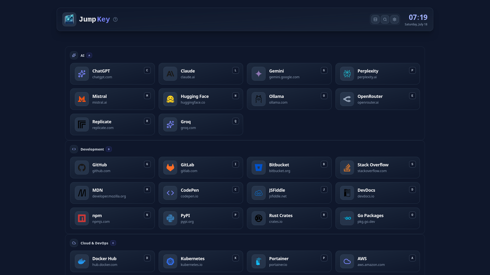
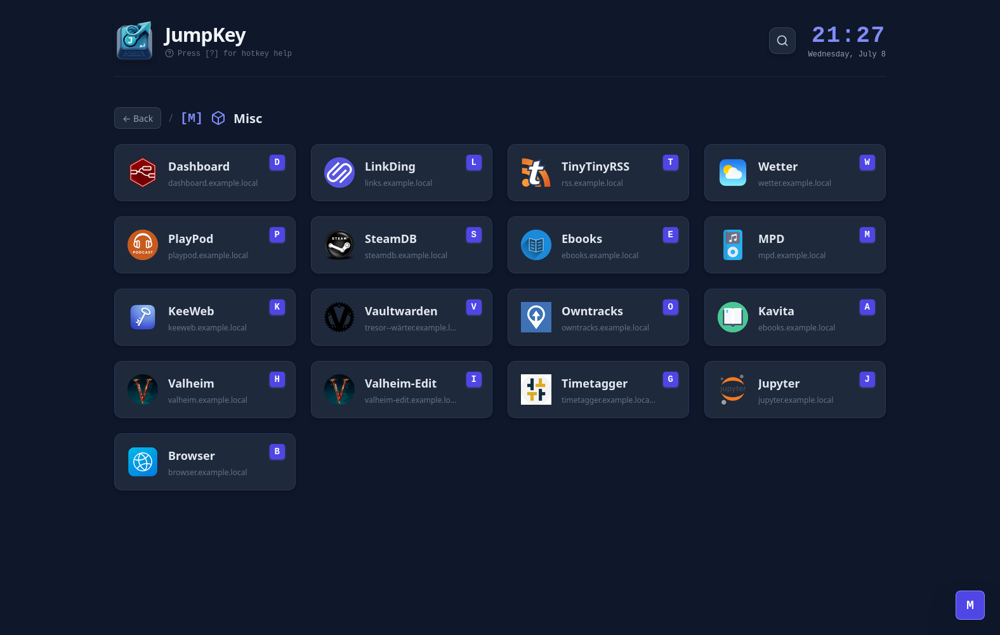
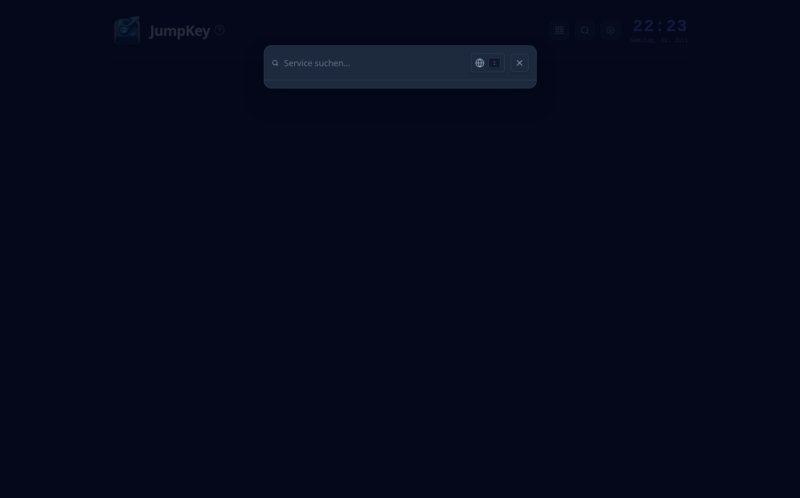
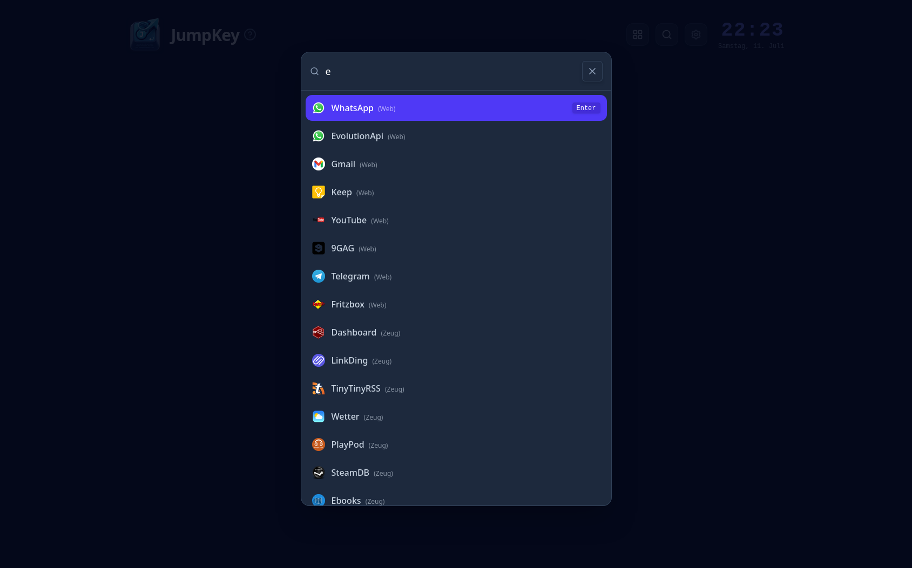

#  JumpKey

## Screenshots

  
  
  
  

## Quick Start

Copy/adjust [compose.yml](compose.yml) and [services.json](services.example.json) and run

\`\`\`bash
docker compose up -d
\`\`\`

## Disclaimer
Project was build with AI support. I am a lazy dev...

