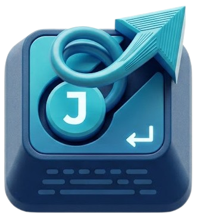

<p align="center">
  
</p>

<h1 align="center">JumpKey</h1>

#### JumpKey — A minimalist, keyboard-driven local first PWA startpage for your services.


<p align="center">
  
</p>

https://github.com/user-attachments/assets/b2c4290e-f371-44eb-b47c-44d5a73de379

## [Live Demo](https://desirevolution.github.io/jump-key/)

## Features

- **Keyboard-Centric Navigation**: Navigate categories and launch services using sequential keyboard shortcuts.
- **Category Organization**: Group services into configurable categories.
- **Favorites**: Mark frequently used services as favorites for quick access.
- **Last Used**: Mark last used services for quick access.
- **Instant Search**: Filter services in real time while typing.
- **Search Engine Integration**: Configure multiple search engines for quick web searches.
- **Built-in Configuration Editor**: Edit the configuration directly from the web interface.
- **Configuration Import/Export**: Create/restore local configuration backup.
- **Configuration Validation**: Validate JSON before applying changes.
- **Responsive User Interface**: Optimized for desktop and mobile devices.
- **Localization Support**: Automatic language detection with internationalization support. Currently DE, EN, FR, ES included.
- **Icons**: Lucide icon name, local hosted images and urls.
- **Themes**: 6 dark and 3 light themes included.
- **Docker Ready**: Deploy using the included Docker Compose configuration. (amd64/arm64 ~60 mb image)
- **Lightweight Architecture**: Built with Lit for fast rendering and minimal resource usage.
- **Static Deployment**: No backend or database required. (Caddy + WebDav plugin)
- **Simple Multi-User Support**: Map Remote-User header as part of the saved config file.

## Screenshots

<p align="center">
  <a href="screenshots/screenshot_2.png">
    
  </a>
  <a href="screenshots/screenshot_3.png">
    
  </a>
  <a href="screenshots/screenshot_4.png">
    
  </a>
  <a href="screenshots/screenshot_5.png">
    
  </a>
  <a href="screenshots/screenshot_6.png">
    
  </a>
</p>

## Keyboard Shortcuts
| Shortcut | Action |
|----------|--------|
| `A-Z` | Select a category |
| `A-Z` → `A-Z` | Launch a service from the selected category |
| `1-0` | Open a favorite |
| `Shift + 1-0` | Open a recent service |
| `-` | Cycle through recently used services (press `-` again before launch to select the next one) |
| `Space` | Open search |
| `#` | Toggle between grouped and grid view |
| `Esc` | Cancel the current input or pending launch |
| `Shift + Click` / `Shift + Enter` | Open in the current tab |
| `Ctrl + 1-0` | Assign a favorite to a slot |
| `Ctrl + ,` | Open configuration |
| `?` | Show keyboard help |

## Quick Start

Copy/adjust [compose.yml](compose.yml) and /config/[services.json](services.example.json) and put all your custome icon images in /icon.

Then run:

```bash
# caddy webdav container needs write access to the config directory
chown -R  100 config

docker compose up -d
```

## Configuration

The application is configured through the `config/services.json` file.

### Available Options

| Key                            | Type     | Description                                                                                          |
| :----------------------------- | :------- | :--------------------------------------------------------------------------------------------------- |
| `categories`                   | `Array`  | List of category objects grouping your web services.                                                 |
| `categories[].category`        | `String` | The visible display name of the category block.                                                      |
| `categories[].categoryKey`     | `String` | _(Optional)_ The keyboard hotkey character to activate this category. Auto-assigned if omitted.      |
| `categories[].icon`            | `String` | Lucide icon identifier (e.g., `layout-grid`), image URL or filename matching an image in `./icons/`. |
| `categories[].services`        | `Array`  | Array of links belonging inside this group.                                                          |
| `categories[].services[].name` | `String` | Title of the specific web application or website.                                                    |
| `categories[].services[].url`  | `String` | Full destination URL (e.g., `https://github.com`).                                                   |
| `categories[].services[].key`  | `String` | _(Optional)_ Specific hotkey to launch this item once its category is open.                          |
| `categories[].services[].icon` | `String` | Lucide icon identifier (e.g., `layout-grid`), image URL or filename matching an image in `./icons/`. |
| `searchEngines`                | `Array`  | Custom query shortcuts available inside the unified search bar using the `:` indicator.              |
| `searchEngines[].name`         | `String` | Display name of the external search provider.                                                        |
| `searchEngines[].prefix`       | `String` | The keyword trigger text (e.g., `g` maps to searching via `:g <query>`).                             |
| `searchEngines[].url`          | `String` | Search engine query URL string containing `%s` as the search term placeholder.                       |
| `searchEngines[].icon`         | `String` | Lucide icon identifier (e.g., `layout-grid`), image URL or filename matching an image in `./icons/`. |

### Sample `services.json`

```json
{
  "categories": [
    {
      "category": "Development",
      "categoryKey": "d",
      "icon": "code",
      "services": [
        {
          "name": "GitHub",
          "url": "https://github.com",
          "key": "g",
          "icon": "github.png"
        },
        {
          "name": "Local Host",
          "url": "http://localhost:8080",
          "key": "l",
          "icon": "globe"
        }
      ]
    },
    {
      "category": "Monitoring",
      "categoryKey": "m",
      "icon": "activity",
      "services": [
        {
          "name": "Grafana",
          "url": "https://grafana.example.com",
          "key": "g",
          "icon": "trending-up"
        }
      ]
    }
  ],
  "searchEngines": [
    {
      "name": "Google",
      "prefix": "g",
      "url": "https://www.google.com/search?q=%s",
      "icon": "search"
    },
    {
      "name": "Wikipedia",
      "prefix": "w",
      "url": "https://en.wikipedia.org/wiki/Special:Search?search=%s",
      "icon": "book-open"
    }
  ]
}
```
## Security Notice

JumpKey is intended for trusted environments only. It is designed to run on a local network or behind an authentication proxy such as Authelia, Authentik, or a similar SSO solution.
Therefore, I don't plan to spend extra effort hardening it for Internet-facing deployments. If you expose it publicly, you are responsible for providing appropriate authentication and security.

## Multi-user support (Authelia etc.)

Remote-User header if detected is used as a part of the expected local config name:

"Remote-User" header | expected config file | (automatic) backup file 
---|---|---
not set | services.json | services.backup-2026-07-25T06-54-03-332Z.json
arthur | services.arthur.json | services.arthur.backup-2026-07-25T06-54-03-332Z.json

## Ideas/Todos

- **Workspaces**: Work/private separation. (functional)
- **Standalone server**: golang wrapper server, replaces the caddy setup. (technical)


## Disclaimer

#### Project was build with AI support. I am a lazy dev...
